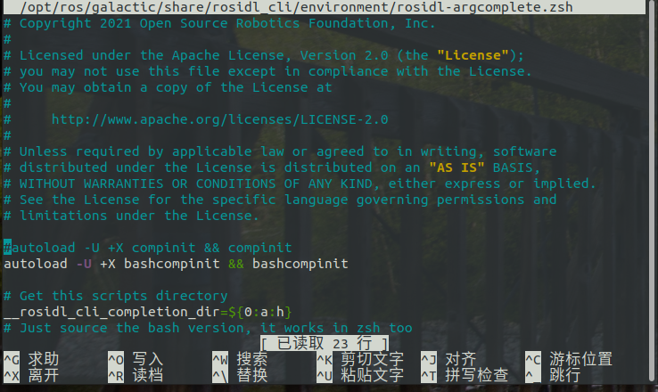

#zsh中ros2 tab自动补全

解决方法来源：

[Autocomplete fails while using zsh](https://github.com/ros2/ros2cli/issues/534)
环境：

* Ubuntu20.04
* ros-galactic

以galactic为例

```bash
sudo nano /opt/ros/galactic/share/rosidl_cli/environment/rosidl-argcomplete.zsh 
```

将下行注释掉

```bash
autoload -U +X compinit && compinit
```



```bash
#autoload -U +X compinit && compinit
```

# colcon自动补全

将下列命令加入 ~/.zshrc 末尾

```bash
eval "$(register-python-argcomplete3 colcon)"
```

最后重新source一下配置

```bash
source ~/.zshrc
```
